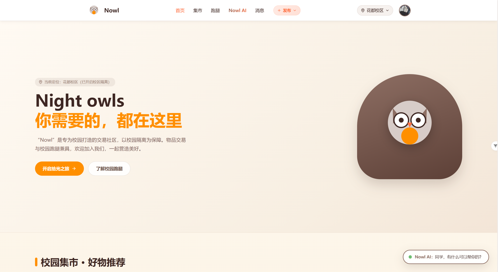
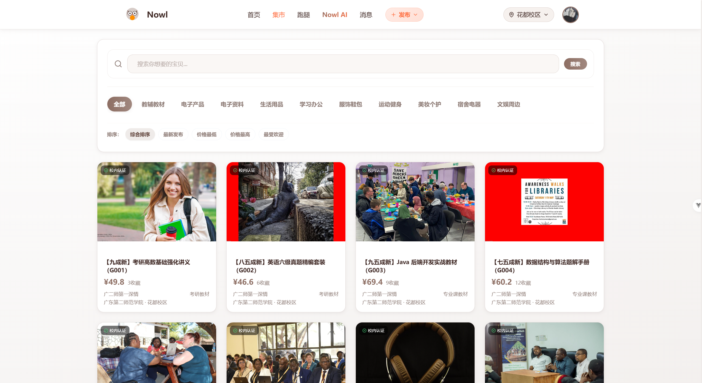
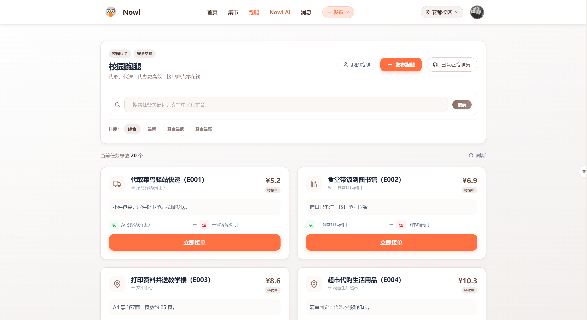
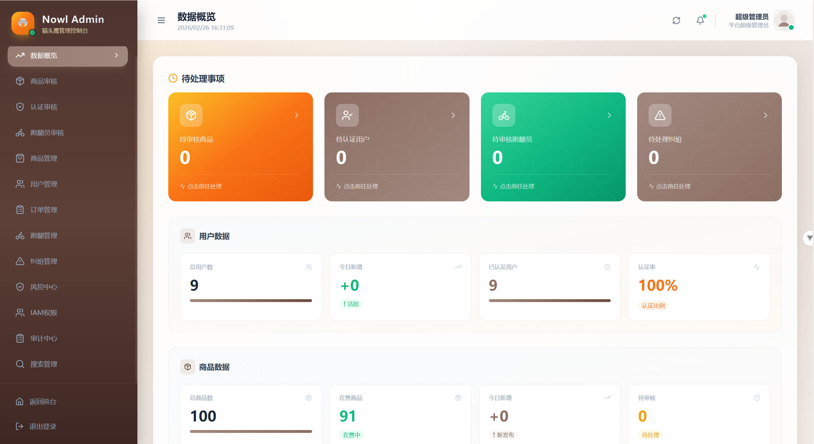
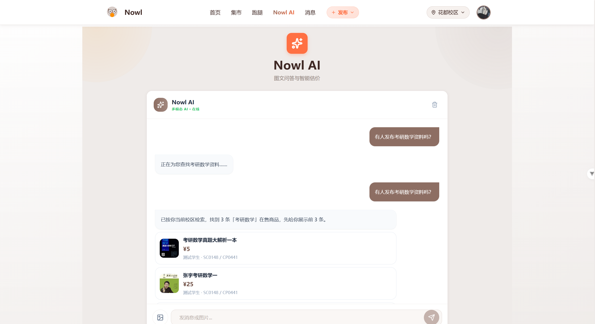

<div align="center">

# 🌙 Nowl · 校园商品 × 跑腿 × AI 一体化平台

<p>
  <strong>Night Owl（夜猫子）校园交易平台</strong><br/>
  把「二手交易」「校园跑腿」「AI 助手」「后台治理」融合在一个完整系统中
</p>

<p>
  
  
  
  
</p>

<p>
  <a href="#-项目亮点">项目亮点</a> ·
  <a href="#-功能矩阵">功能矩阵</a> ·
  <a href="#-快速开始">快速开始</a> ·
  <a href="#-系统架构">系统架构</a> ·
  <a href="#-文档导航">文档导航</a>
</p>

</div>

---

## ✨ 项目亮点

- **场景融合**：商品交易 + 跑腿服务 + AI 互动推荐 + 钱包充值，覆盖校园高频需求
- **治理完善**：包含后台管理、IAM 权限体系、风控链路、纠纷处理闭环、信用等级机制
- **工程化完整**：前后端分层清晰，后端 8 模块微服务架构，支持中间件按需启用
- **学习价值高**：适合作为课程设计、毕业设计或中大型全栈项目实践样板

---

## 🖼 界面预览

<p>
  
  
</p>
<p>
  
  
</p>
<p>
  
</p>

---

## 🧩 功能矩阵

### 用户侧能力

- **商品链路**：发布 → 风控 → AI 审核 →（必要时）人工复核 → 上架
- **订单链路**：下单防超卖锁 → 托管阶段 → 退款/纠纷互斥 → 结算/结束
- **跑腿链路**：发布与审核 → 接单互斥 → 履约 → 延迟自动确认
- **钱包充值**：账户余额充值，支持订单支付与跑腿赏金托管
- **信用等级**：基于交易行为的五级信用评估体系（优秀/良好/一般/较差/危险）
- **实名认证**：用户实名认证 + 跑腿员专属申请认证通道
- **评价体系**：订单评价 + 跑腿评价，双向互评，关联信用等级
- **社交能力**：关注 / 粉丝 / 拉黑 / 私聊 / 消息中心
- **AI 能力**：AI 对话、在售商品推荐、智能商品审核辅助、跑腿任务审核
- **纠纷处理**：商品纠纷 + 跑腿纠纷，支持退款、驳回、协商闭环

### 平台治理能力

- **多级权限（IAM）**：超管、学校级/校区级管理员、运营角色，细粒度权限点控制
- **风控体系**：黑白名单、阈值规则、关键词策略、高级信号、工单管理
- **审计中心**：管理员操作日志、登录追踪、权限变更记录
- **搜索推荐**：Elasticsearch 检索高亮 + Redis 热搜/历史 + 协同过滤推荐
- **通知系统**：消息落库 + WebSocket 推送 + `bizType` 业务跳转

### 商品分类覆盖

10 个一级分类、60 个二级分类，涵盖校园二手交易全场景：

| 一级分类 | 典型二级分类 |
|---------|------------|
| 教辅教材 | 专业课教材、考研教材、考公教材、笔记讲义 |
| 电子产品 | 手机、笔记本电脑、平板电脑、耳机音箱、**游戏设备** |
| 电子资料 | 课程PPT、历年真题、编程开发资料、设计素材 |
| 生活用品 | 收纳整理、床上用品、洗护用品、厨房餐具 |
| 学习办公 | 文具用品、台灯护眼、计算器、打印设备 |
| 服饰鞋包 | 上衣外套、运动鞋、包袋书包、正装礼服 |
| 运动健身 | 球类用品、跑步装备、力量训练、瑜伽普拉提 |
| 美妆个护 | 护肤品、彩妆、香水香氛、个护电器 |
| 宿舍电器 | 小风扇、电煮锅、加湿器、路由器 |
| 文娱周边 | 书籍小说、乐器、手办潮玩、**桌游卡牌**、演出票券 |

---

## 🏗 系统架构

- **前端**：Vue 3 + TypeScript + Vite + Pinia + Tailwind CSS
- **后端**：Spring Boot 3 多模块 + MyBatis-Plus 3.5 + MySQL 8.0
- **中间件（Docker Compose 一键部署）**：
  - MySQL 8.0 + Redis 7
  - RocketMQ 5.1.4（异步审核、索引同步、延迟任务）
  - Elasticsearch 8.13.0（IK + 拼音分词器，检索高亮）
  - XXL-JOB 2.4.0（推荐离线任务调度）

仓库结构：

```text
Nowl/
├── Nowl-front/        # Vue3 前端（39 条路由，46 个视图文件）
├── Nowl-backend/      # Spring Boot 多模块后端（22 个 Controller，33 个实体）
│   ├── unimarket-web          # 业务主模块（商品/订单/跑腿/纠纷/AI/社交）
│   ├── unimarket-security     # 安全认证（JWT + 业务鉴权）
│   ├── unimarket-core         # 核心基础（充值/文件/异常处理）
│   ├── unimarket-admin        # 后台管理（仪表盘/审核/IAM/风控/审计）
│   ├── unimarket-search       # 搜索服务（ES 检索与同步）
│   ├── unimarket-recommend    # 推荐服务（协同过滤/离线计算）
│   ├── unimarket-ai           # AI 服务（对话/推荐/审核）
│   └── unimarket-gateway      # API 网关（认证/审计/限流/追踪）
├── sql/               # 数据库初始化脚本
├── docker/            # Docker 辅助配置
└── docs/              # 设计说明书 / 部署文档 / 风控说明
```

---

## 🚀 快速开始

### 1) 环境要求

- JDK 17+
- Maven 3.9+
- Node.js 18+ 与 npm
- Docker & Docker Compose（推荐）

### 2) Docker 一键部署（推荐）

```bash
# 启动全部服务（MySQL/Redis/RocketMQ/ES/XXL-JOB/后端/网关/前端）
docker-compose up -d
```

访问地址：

| 服务 | 地址 |
|------|------|
| 前端 | http://localhost:3000（或自定义 `FRONTEND_PORT`） |
| 网关 | http://localhost:8090 |
| 后端 | http://localhost:8080 |

### 3) 本地开发模式

```bash
# Docker 启动中间件
docker-compose up -d mysql redis

# 启动后端（IDE 或命令行）
cd Nowl-backend
mvn -q -DskipTests -pl unimarket-web -am spring-boot:run

# 启动前端
cd Nowl-front
npm install
npm run dev
```

开发环境访问：

- 前端: `http://localhost:5173`
- 网关: `http://localhost:8090`
- 后端: `http://localhost:8080`

### 4) 环境变量配置

参考根目录 `.env.example`（所有敏感字段已清空，需自行填写）：

必需项：

- `DB_URL` `DB_USERNAME` `DB_PASSWORD`
- `REDIS_HOST` `REDIS_PORT`（有密码再加 `REDIS_PASSWORD`）
- `JWT_SECRET`

可选项：

- AI：`OPENAI_API_KEY` `OPENAI_BASE_URL` `OPENAI_MODEL`
- COS：`COS_SECRET_ID` `COS_SECRET_KEY` `COS_REGION` `COS_BUCKET_NAME`
- MQ：`ROCKETMQ_NAME_SERVER`
- ES：`ES_HOST`
- XXL：`XXL_JOB_ADMIN_ADDRESSES`
- 邮件：`MAIL_ENABLED` `MAIL_HOST` `MAIL_PORT` `MAIL_USERNAME` `MAIL_PASSWORD`

---

## 🔐 管理员初始化

初始化 SQL 会注入角色与权限点，但不会自动创建管理员账号。
可先注册普通账号，再在数据库绑定管理员角色与范围。

```sql
-- 绑定超管角色
INSERT INTO iam_user_role(user_id, role_id, status)
SELECT 123, role_id, 1
FROM iam_role
WHERE role_code = 'SUPER_ADMIN'
ON DUPLICATE KEY UPDATE status = 1;

-- 绑定全平台管理范围
INSERT INTO iam_admin_scope_binding(user_id, scope_type, status)
VALUES (123, 'ALL', 1);
```

> 将 `123` 替换为你的实际用户 ID。

---

## 📚 文档导航

- 系统设计说明书：`docs/Nowl系统设计说明书.md`
- 中间件部署文档：`docs/中间件部署文档.md`
- 项目经历说明：`docs/简历项目经历-Nowl.md`
- 风控压测说明：`docs/风控压测说明.md`

---

## 🤝 适用人群

- 想做**毕业设计 / 课程设计**的同学
- 想学习**Vue 3 + Spring Boot 3 全栈工程化**实践的开发者
- 想了解**校园交易 + 平台治理 + 风控体系**落地方式的同学

如果这个项目对你有帮助，欢迎点个 **Star** ⭐

---

## 📄 License

MIT License，详见 `LICENSE`。
